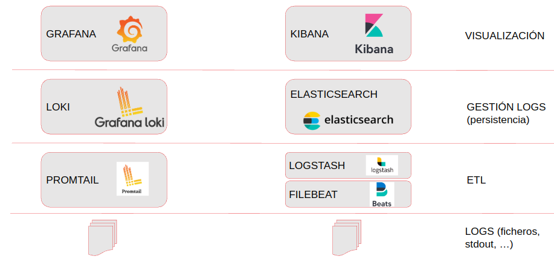

# Monitorizando nuestras aplicaciones en PulpoCon 2022

## Requisitos

- Docker versión > 20.10
- Docker compose
- Preferible un entorno Linux


Si se tiene compose V1 (el clásico script Python) en lugar del plugin de compose V2 las instrucciones serán con 
docker-compose en lugar de docker compose. Y los nombres de los contenedores llevarán _ en lugar de - (i.e. 
pulpocon_prometheus_1).


## Monitorizando logs con Kibana + ElasticSearch + Logstash + Filebeat

*Modo rápido*
Puedes lanzar todo de una vez, pero queremos ~~rellenar tiempo~~ ver con calma lo que estamos haciendo!

```bash
cd elastic-stack
docker compose -p pulpocon up -d
```

### ¿Qué estamos desplegando?



* ELASTICSEARCH: base de datos nSQL con un potente motor de búsqueda especialmente útil para texto.
* KIBANA: visualización desde elastic (se podría usar Grafana)
* LOGSTASH: Cliente ETL: input -> transforma -> output.
* FILEBEAT: ingestador de ficheros

En el stack planteado, Filebeat es el encargado de leer los ficheros de logs y dejarlos disponibles para que 
Logstash los ingeste, aplicando transformaciones si se considera necesario. Es Logstash el que escribe en elasticsearch.

### ¿Cómo configuramos Filebeat para recoger logs?

Archivo filebeat.yml, que le pasamos al contenedor como un volumen.

Estructura de la [configuración](https://www.elastic.co/guide/en/beats/filebeat/current/configuring-howto-filebeat.html)

Podría enviar los logs directamente a elastic, pero logstash admite más flexibilidad de operaciones y variedad de 
fuentes.

*Ejercicios paso a paso*

### Ejercicio 1: fichero de logs

```bash
# Lanzamos Kibana
docker compose -p pulpocon up -d kibana

# Lanzamos ElasticSearch
docker compose -p pulpocon up -d elasticsearch

# Lanzamos Logstash
docker compose -p pulpocon up -d logstash

# Lanzamos Filebeat
docker compose -p pulpocon up -d filebeat
```

Filebeat se ha configurado para escuchar todos los ficheros `*.log` que aparezcan en la carpeta `logs` del host. 
Puedes enviar el fichero de log `log_example.log`, el mismo que usamos en el ejercicio de Loki, línea a línea con una 
pausa de medio segundo entre líneas del siguiente modo:
```bash
while read line; do echo $line; sleep 0.5; done < log_example.log > ../logs/test.log
```

Mientras se sube el fichero, entra en [Kibana](http://localhost:5601) e intenta configurar encontrar los logs. _Tip: Discover_

Una vez visualizados los logs, trata de crear alguna visualización. _Tip: Dashboard_

### Ejercicio 2: docker logging driver

Para este ejercicio es necesario instalar el plugin de docker de elastic, que permite usar un driver específico para 
enviar los logs de los contenedores a elastic.

```bash
docker plugin install elastic/elastic-logging-plugin:8.4.1 --alias elastic --grant-all-permissions

# Comprueba la instalación
docker plugin ls
```

Se podría configurar como driver global (en /etc/daemon.json), pero en este ejercicio se lo vamos a configurar aun 
nuevo servicio.

#### Servicio generador de logs

Se trata de un servicio que genera logs fake, en el formato y cadencia que se le indique. Usaremos el servicio
log-generator para comprobar el funcionamiento del plugin de docker.
El formato de logs configurado es [Apache combined](http://fileformats.archiveteam.org/wiki/Combined_Log_Format).

Puedes probar también a generarlos en formato json y ver las diferencias.

```bash
docker compose -p pulpocon up -d log-generator
```

No es necesario tocar nada en Filebeat o Logstash, en este caso no se usarán. Al poco aparecerán nuevos logs en Elastic 
con etiquetas como container.name=pulpocon-log-generator-1