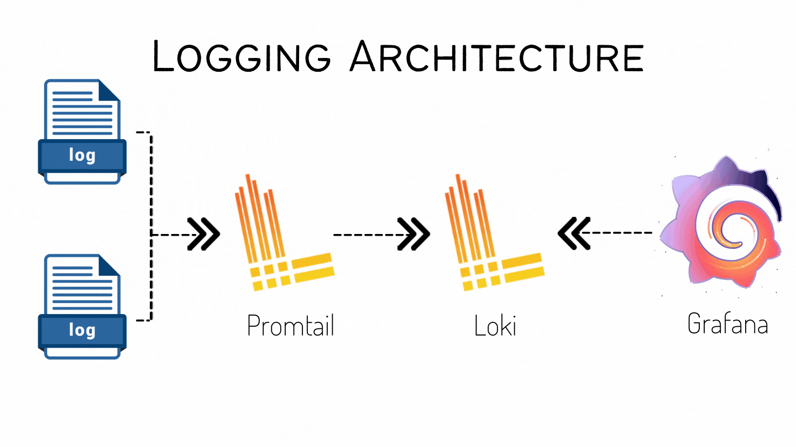

# Monitorizando nuestras aplicaciones en PulpoCon 2022

## Requisitos

- Docker versión > 20.10
- Docker compose
- Preferible un entorno Linux

Si tienes compose V1 (el clásico script Python) en lugar del plugin de compose V2 las instrucciones serán con 
docker-compose en lugar de docker compose.

## Monitorizando logs con Grafana + Loki + Promtail

En esta carpeta encontrarás el fichero compose para levantar un stack Open Source de agregación de logs.

*Modo rápido*
Puedes lanzar todo de una vez, pero queremos ~~rellenar tiempo~~ ver con calma lo que estamos haciendo!

```bash
cd grafana-stack
cp config/promtail3.yml config/promtail.yml
docker compose -p pulpocon up -d
```

### ¿Qué estamos desplegando?



* LOKI: agregador de logs (podría usar una Base de datos para almacenamiento)
* GRAFANA: visualización (loki datasource)
* PROMTAIL: Cliente ingestador de logs, especialmente desde ficheros.

Loki ofrece una API para enviar y consultar logs (queries [LogQL](https://grafana.com/docs/loki/latest/logql/)). 
En el stack planteado, Promtail es el encargado de scrapear las fuentes de logs y enviarlos a Loki (podría usarse 
fluentd, etc).

### ¿Cómo configuramos Promtail para recoger logs?

Archivo promtail.yml, que le pasamos al contenedor como un volumen. En la carpeta config hay varias versiones, que 
van añadiendo funcionalidades (según los ejercicios planteados a continuación).

Estructura de la [configuración](https://grafana.com/docs/loki/latest/clients/promtail/configuration/):

- server: configura el servidor http de promtail (entre otras cosas, ofrece /metrics)
- client: cómo se conecta a Loki
- positions: cómo salva los offsets de lectura de los diferentes ficheros que scrapea
- scrape_configs: trabajos de scrapeo de logs, es decir dónde y cómo debe leer logs.
    - service discovery (sd) jobs: para ayudar con los logs de servicios conocidos (i.e docker)
    
*Ejercicios paso a paso*

La estructura de este taller es igual a la de Prometheus. Si los recursos de tu máquina lo permiten puedes mantener 
tod el stack anterior.

### Ejercicio 1: fichero de logs

En este ejercicio vamos a ingestar un fichero de logs. Para ello vamos a simular su generación, para ir viendo cómo 
va apareciendo en Loki. 

#### Grafana

Si ya lo lanzaste en el ejercicio de Prometheus (y está en ejecución) puedes saltarte este paso. 

ACCESO:
http://localhost:3000/
- user: pulpocon
- pass: rules

```bash
# Lanzamos Grafana (si ya lo lanzamos en el ejercicio 1 se puede omitir)
docker compose -p pulpocon up -d grafana
```

#### Loki

[loki](https://grafana.com/oss/loki/)

```bash
# Lanzamos Loki
docker compose -p pulpocon up -d loki
```
Podemos comprobar que está emitiendo métricas en http://localhost:3100

#### Promtail

[promtail](https://grafana.com/docs/loki/latest/clients/promtail/)

Para que promtail pueda leer los ficheros de log es necesario montar todos los ficheros que debe ingestar. para este 
ejercicio es necesario montar ../logs, que donde vamos a crear nuestro nuevo fichero.

Necesitamos configurar Promtail para definir un trabajo de scrapeo que vigile los logs en esa carpeta. Tip: fichero 
promtail1.yml

```bash
# Lanzamos Promtail
cp config/promtail1.yml config/promtail.yml
docker compose -p pulpocon up -d promtail
```

Usaremos un [log de ejemplo](https://github.com/logpai/loghub/tree/master/Apache) de Apache. Está en 
`log_example/Apache_2k.log`.

Vamos a enviar su contenido, línea a línea con una pausa de medio segundo entre líneas, del siguiente modo:
```bash
while read line; do echo $line; sleep 0.5; done < log_example/Apache_2k.log > ../logs/test.log
```

Mientras se va enviando el fichero, entra en [Grafana](http://localhost:3000) e intenta configurar Loki. _Tip: Data 
sources_

Una vez configurado Loki, trata de explorar los logs. Puedes ver en el archivo de configuración las etiquetas que 
usamos.

Ahora prueba a hacer alguna gráfica de conteo de los logs, p. ej:
```promql
count_over_time({job="pulpolog"}[1m])
```
Prueba a filtrar por tipo de log (error, notice,...). Es interesante ver que el timestamp que usa Loki es el de 
ingesta, no el de las líneas de logs originales, ya que no reconoce el campo como tal.

### Ejercicio 2: docker logging driver

Para este ejercicio es necesario instalar el plugin de docker de loki, que permite usar un driver específico para 
enviar los logs de los contenedores a Loki.

```bash
docker plugin install grafana/loki-docker-driver:latest --alias loki --grant-all-permissions

# Comprueba la instalación
docker plugin ls
```

Se podría configurar como driver global (en /etc/daemon.json), pero en este ejercicio se lo vamos a configurar aun 
nuevo servicio.

#### Servicio generador de logs

Se trata de un servicio que genera logs fake, en el formato y cadencia que se le indique. Usaremos el servicio 
log-generator para comprobar el funcionamiento del plugin de docker. 
El formato de logs configurado es [Apache combined](http://fileformats.archiveteam.org/wiki/Combined_Log_Format).
 
Puedes probar también a generarlos en formato json y ver las diferencias.

```bash
docker compose -p pulpocon up -d log-generator
```

No es necesario tocar nada en Promtail, en este caso no se usará. Al poco aparecerán nuevos logs en Loki, con etiquetas 
como compose_service="log-generator".

Los logs siguen un patrón de contenido (apache combined). Se puede añadir al pipeline de consulta para extraer 
fácilmente etiquetas con la que trabajar:
```promql
sum by(statuscode) (rate({compose_service="log-generator"} | pattern `<hostip> <clientid> <username> [<ts>] "<request>" 
<statuscode> <bytes> "<referer>" "<useragent>"` [1m]))
```

### Ejercicio extra 1: docker logs

Para agregar los logs de los contenedores docker del host, podemos definir un trabajo en Promtail que use el socket de 
docker para obtener los logs. De esta manera tendremos etiquetas y filtros con la información de los contenedores. 
Otra opción sería montar la ruta en la que docker almacena los logs (driver json, por defecto) y definir un trabajo 
que los ingeste. Esto requeriría añadir etiquetas en la configuración del driver para tener información de los 
nombres de contenedores, etc.

Para esto promtail necesita dos cosas:
- acceso de lectura al socket de docker (/var/run/docker.sock) _tip: docker-compose.yml_
- un trabajo usando docker_sd_config para descubrimiento de contenedores _tip: fichero promtail2.yml_

```bash
docker compose -p pulpocon up -d promtail
```

Explora los logs que se añaden y trata de hacer alguna gráfica. Pista, para los logs de loki, prometheus, etc logfmt 
permite extraer las etiquetas fácilmente, ya que son estructurados

### Ejercicio extra 2: system logs

Para agregar los logs de un sistema con systemd en Loki podemos definir un trabajo en Promtail de tipo
journal. De esta manera tendremos etiquetas y filtros con la información de los servicios de systemd.

Para esto promtail necesita dos cosas:
- acceso de lectura a /var/log  _tip: docker-compose.yml_
- un trabajo usando journal _tip: fichero promtail3.yml_

Es necesario recrear el contenedor de promtail:

```bash
docker compose  compose -p pulpocon up -d promtail
```

Explora los logs que se añaden. El servicio de docker estará activo, por ejemplo.

