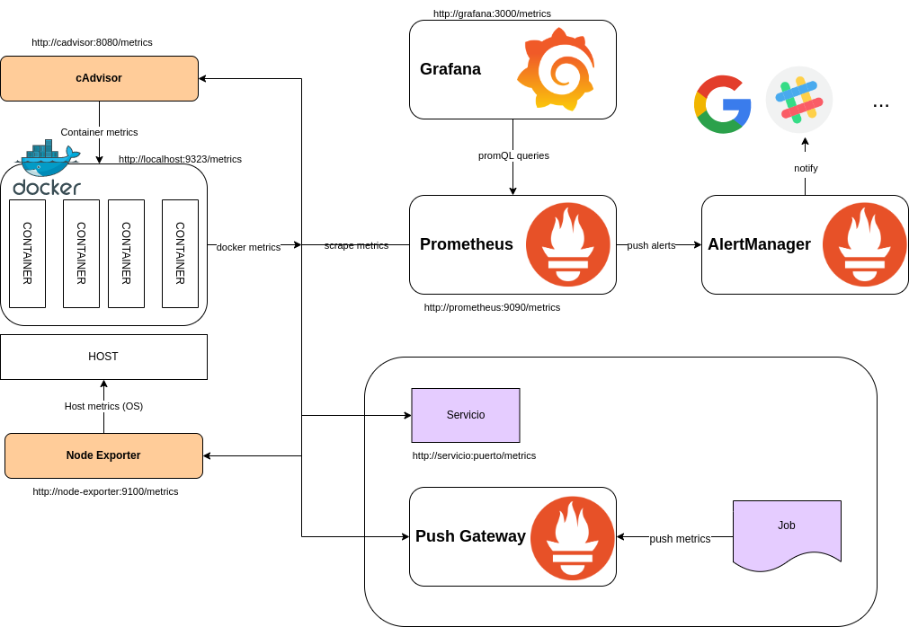

# Monitorizando nuestras aplicaciones en PulpoCon 2022

## Requisitos

- Docker versión > 20.10
- Docker compose
- Preferible un entorno Linux

Si se tiene compose V1 (el clásico script Python) en lugar del plugin de compose V2 las instrucciones serán con 
docker-compose en lugar de docker compose. Y los nombres de los contenedores llevarán _ en lugar de - (i.e. 
pulpocon_prometheus_1).

## Monitorizando sistemas con Prometheus

En esta carpeta encontrarás el fichero compose para levantar la infraestructura para monitorizar tu máquina.

*Modo rápido*
```bash
cd prometheus
cp config/prometheus4.yml config/prometheus.yml
docker compose -p pulpocon up -d
```
### ¿Qué estamos desplegando?



* PROMETHEUS: agregador de métricas (podría usar una Base de datos para almacenamiento)
* GRAFANA: visualización (prometheus datasource)
* ALERT MANAGER: Notificador de alertas generadas por Prometheus
* NODE EXPORTER: servicio que recoge métricas del host y las deja disponibles para que Prometheus pueda scrapearlas
* CADVISOR: servicio que recoge métricas de los contenedores docker y las deja disponibles para que Prometheus pueda 
  scrapearlas

De lo representado en el esquema anterior, no utilizaremos el servicio PUSH GATEWAY, que permite disponibilizar 
métricas de aplicaciones que se las pushean. Es especialmente útil para trabajos temporales, que habitualmente no es 
operativo configurar como jobs de scrapeo.

Cualquier aplicación se puede instrumentar (usando librerías para ayudar) para disponibilizar sus métricas en un 
endpoint 
(/metrics) siguiendo el formato esperado por Prometheus

### ¿Cómo configuramos Prometheus para recoger métricas?

Archivo prometheus.yml, que le pasamos al contenedor como un volumen. En la carpeta config hay varias versiones, que 
van añadiendo funcionalidades (según los ejercicios planteados).

Estructura de la [configuración](https://prometheus.io/docs/prometheus/latest/configuration/configuration/):

- global: configuraciones globales
- rule_files: fichero en donde se configuran las reglas a evaluar para generar alertas o calcular nuevas métricas 
  (records)
- alerting: configura cómo hace push de las alertas
- scrape_configs: trabajos de scrapeo (pull de métricas), es decir dónde y cómo debe leer métricas.
- service discovery(sd): para determinado tipo de fuentes permite descubrir cómo scrapearlas. En este taller no 
  vamos a hacer uso de estas funcionalidades
- remote_writer: permite enviar métricas a otros servicios, como NewRelic, etc. Tampoco vamos a usarlo


*Ejercicios paso a paso*

### Ejercicio 1: monitorizar el sistema

En este ejercicio vamos a desplegar el stack base y configurar las 2 primeras monitorizaciones de métricas.

#### Alertmanager

[alertmanager](https://github.com/prometheus/alertmanager)

Emite alertas según las reglas configuradas en Prometheus, en la sección rule_files.

```bash
docker compose -p pulpocon up -d alertmanager
```

- Usamos el fichero alermanager/config.yml para editar cómo se alerta (Hay una configuración de ejemplo para slack, 
  podrían configurarse otras fuentes).

Comprueba la interfaz disponible en http://localhost:9093/

#### Node exporter
[node-exporter](https://github.com/prometheus/node_exporter)

Exporta métricas de la máquina para que se pueden scrapear.

```bash
docker compose -p pulpocon up -d node-exporter
```
Comprueba que las métricas están disponibles en http://localhost:9100/metrics

En algunos sistemas puede ser necesario añadir SYS_TIME para recolectar tiempos. Se montan rutas del OS para poder 
recoger los datos, por lo que es dependiente del OS (tanto en rutas como permisos).

(Para Windows se debe instalar https://github.com/prometheus-community/windows_exporter)

#### Prometheus

[prometheus](https://prometheus.io/)

- Interfaz disponible en http://localhost:9090/
- La propia aplicación emite métricas en http://localhost:9090/metrics

```bash
cp config/prometheus1.yml config/prometheus.yml 
docker compose -p pulpocon up -d prometheus
```

Configuración:
- prometheus.yml
- alert_rules.yml
- record_rules.yml

La versión del fichero de configuración que desplegamos incluye los siguientes jobs de monitorización (sección 
scrape_config en prometheus.yml):
- métricas de Prometheus
- métricas del nodo (generadas por node exporter)

#### Visualización básica

Prometheus expression browser: http://localhost:9090/

- Status
  - targets -> qué está scrapeando para recoger métricas
  - config  -> configuración cargada
- Alerts
  - high_load es probable que esté activa (en alert_rules se ha configurado un umbral bajo para el uso de CPU)
- Graph
  - tiempo de CPU -> visualización de métricas
    - filtro por cpu: node_cpu_seconds_total{cpu="0",mode="user"}
    - todas las cpus: node_cpu_seconds_total{job="node",mode="user"}
    - pasar del valor acumulado a promedio temporal: irate(node_cpu_seconds_total{job="node",mode="user"}[30s])

#### Visualización con Grafana

Debemos primero lanzar Grafana

```bash
docker compose -p pulpocon up -d grafana
```

*ACCESO* (preconfigurado en el .env):
http://localhost:3000/
- user: pulpocon
- pass: rules

Primero hay que configurar el datasource de Prometheus (a quién le pide los datos) (tip: en Settings, 
http://prometheus:9090)

Después se pueden explorar (Explore) las métricas disponibles. La interfaz de queries ofrece 2 modos de trabajo: 
builder, con guías y ayuda, o Code para raw queries.

Se pueden visualizar las métricas empleadas en las reglas de alertas (up, node_load1) o las generadas como records 
(node_filesystem_free_percents, node_memory_free_percents)

Ejemplo de queries para probar:
```promql
node_cpu_seconds_total{cpu="0",mode="user"}
irate(node_cpu_seconds_total{cpu="0",mode="user"}[30s])
100 - 100 * ( node_filesystem_free_bytes{mountpoint="/"} / node_filesystem_size_bytes{mountpoint="/"} )
100 - 100 * (node_memory_MemFree_bytes / node_memory_MemTotal_bytes)
```

Por último se pueden construir dashboards con varias gráficas. 
En este caso, que las fuentes de datos son comunes, lo más cómodo es importar dashboards ya definidos desde grafana.com:
- 1860 : node explorer
- 3662: prometheus


### Ejercicio 2: monitorizar docker

#### cAdvisor

Desplegaremos [cadvisor](https://github.com/google/cadvisor) - Container advisor, que se encargará de recoger 
métricas de los contenedores docker en el host. 

```bash
docker compose -p pulpocon up -d cadvisor
```

Para que pueda hacer su trabajo, este servicio necesita que se le monten como volúmenes varias rutas del host. 
Podría necesitar permisos extra en algunos entornos.

Comprueba que las métricas están disponibles en http://localhost:8080/metrics
En http://localhost:8080/containers/ se puede navegar por los contenedores y ver gráficas e información sobre ellos.

#### Prometheus

Para que Prometheus recoja la información que captura cadvisor, es necesario añadir a su configuración la 
tarea de scrapeo de este servicio, del mismo modo que hicimos en el ejecicio anterior. 

Tip: fichero config/prometheus2.yaml

```bash
docker restart pulpocon-prometheus-1
```

#### Grafana

Podéis explorar los nuevos datos, observando como aparecen métricas y etiquetas nuevas. Ejemplo de queries:

```promql
irate(container_cpu_usage_seconds_total{name="pulpocon-node-exporter-1"}[1m])
```
Tip: Legend {{name}}-{{cpu}}

Importar dashboards específicos de métricas de docker, como antes, disponibles en grafana.com
- 15894: docker
- 179: docker & host

### Ejercicios extra 1: monitorizar docker daemon

El propio demonio de docker está instrumentado para emitir métricas. Para activarlo es necesario editar su fichero 
de configuración (si no existe hay que crearlo):
```bash
sudo nano /etc/docker/daemon.json
```
La ruta variará según el OS del host. Esta es la ruta para los Linux basados en Debian.

Hay que añadir al fichero lo siguiente:
```json
{
 "metrics-addr" : "0.0.0.0:9323",
 "experimental" : true
}
```
Y reiniciar el servicio docker:
```bash
sudo systemctl restart docker
```
Una vez reiniciado, puedes comprobar que las métricas están en http://172.17.0.1:9323/metrics

#### Prometheus

En la configuración de prometheus se debe añadir un job, docker, que debe tener como target la <ip del 
host>:9323 (La IP que "ve" Prometheus). 
Tip: fichero config/prometheus3.yaml

Es necesario modificar el despliegue para añadir el host de docker, para facilitar la resolución de su IP (Esto 
funciona automáticamente en el despliegue para Docker > 20.10 en linux usando el compose proporcionado y descomentando extra_hosts)

Ejemplo de métricas proporcionadas por docker:
```promql
- builder_builds_failed_total{job="docker"}
- engine_daemon_container_states_containers{state="running"}
```

### Ejercicio extra 2: monitorizar los servicios que vayamos desplegando

Se pueden añadir las métricas de los servicios que se van desplegando en el taller, tanto de este stack como de los 
de agregación de logs:
- http://alertmanager:9093/metrics
- http://grafana:3000/metrics
- http://loki:3100/metrics
- http://promtail:9080/metrics

Tip (fichero config/prometheus4.yaml):
```promql
  - job_name: 'new-service'
    scrape_interval: 5s
    static_configs:
      - targets: ['new-service:new-service-port']
```

Para métricas Loki y promtail, se puede importar el dashboard 10004

## Extras

### Portainer 
Portainer nos ofrece una interfaz web para ayudar a gestionar los recursos docker en https://localhost:9443. 

En la primera ejecución es necesario asignar un usuario y contraseña, y configurar el entorno local.

```bash
 docker run -d -p 9443:9443 --name portainer --restart=always -v /var/run/docker.sock:/var/run/docker.sock -v portainer_data:/data portainer/portainer-ce:latest
```

